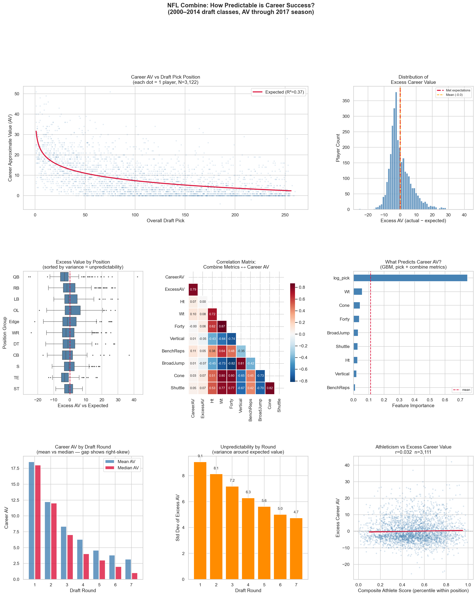
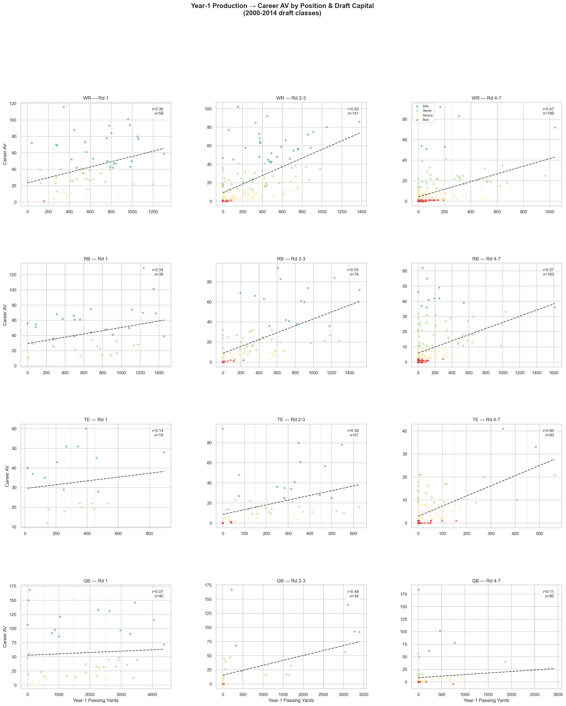
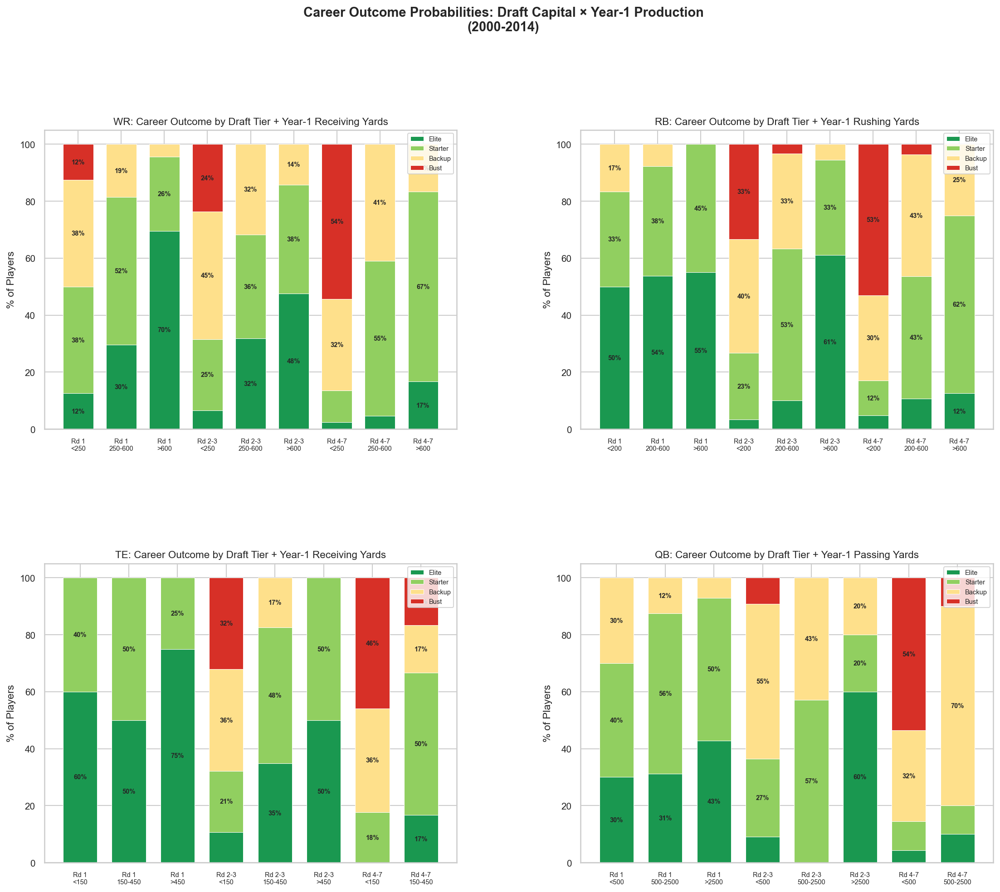
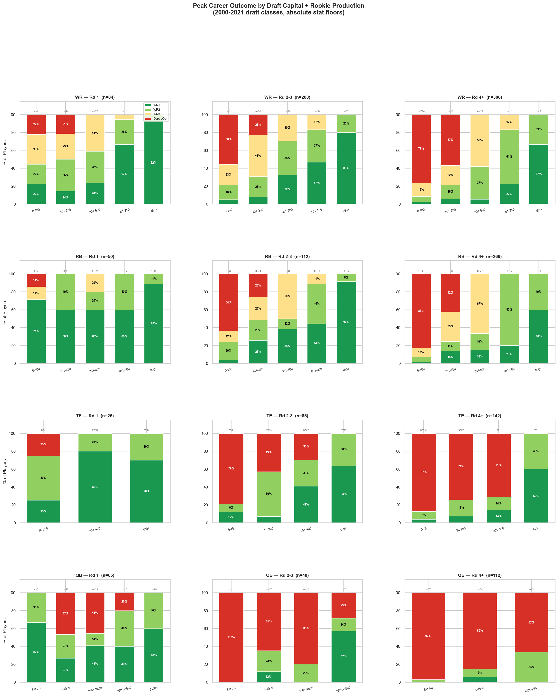
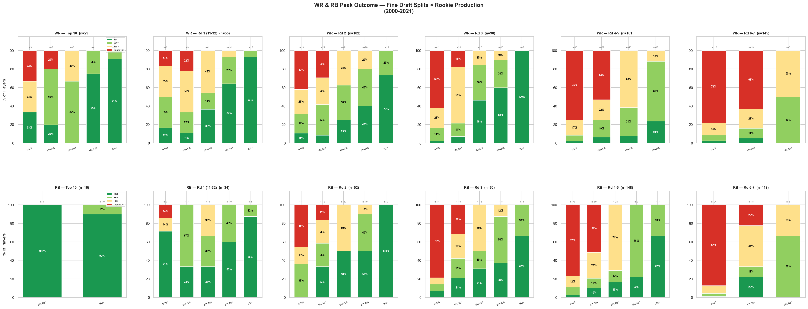

# Draft Theory

**Draft Theory studies how prospect information, draft cost, and positional value interact to decide which NFL draft decisions create the most surplus talent.**

The NFL Draft is not just about finding good players. It is about finding the best expected return *relative to acquisition cost*. Every prospect profile — combine testing, size, college production, level of competition, age and role — carries information. Once that profile is paired with draft capital, the player has an implied expected career outcome.

That creates the central question the whole project is built around:

> **Given a player's pre-draft profile and draft capital, what should we expect his NFL outcome distribution to be — and which players or archetypes historically beat that expectation the most?**

The project is organized around three layers:

- **`Signal`** — what information actually predicts NFL outcomes?
- **`Price`** — how does the league price that information through draft capital?
- **`Strategy`** — how should teams exploit the gap between signal and price?

The sections below walk through what the data says so far, one figure at a time. Together they tell a single story: **the draft is priced mostly right on day one, the combine adds almost nothing, and the real edge comes from how fast you can read the signal *after* a player arrives.**

---

## 1. The combine barely moves the needle

The first question is the simplest one: how predictable is a career from a player's pre-draft background alone?

Using combine classes from 2000–2014 (career Approximate Value measured through 2017), we model career `AV` from draft position and combine testing, then look at the *residual* — how much a player beat or missed the value implied by where he was picked.



What the panels show, and why it matters:

- **Career AV vs draft pick (top-left)** — there is a real, steep relationship. Early picks return far more value, and the curve flattens fast. Draft position alone explains roughly a third of the variance in career value (expected `R² ≈ 0.37`, n = 1,122).
- **What predicts career AV? (middle-right)** — feed a gradient-boosted model both draft pick *and* every combine metric, and `log(pick)` swamps everything. The forty, vertical, bench, broad jump, shuttle and cone barely register.
- **Athleticism vs excess career value (bottom-right)** — a composite athleticism score has **almost no relationship** to beating draft expectation (`r ≈ 0.02`, `R² ≈ 0.001`). The dots are a cloud, not a trend.
- **Excess value by position (middle-left)** — quarterbacks sit at the top because they are the *least* predictable: their outcomes swing hardest around expectation.

**Takeaway:** the combine is largely already priced into where a player gets drafted. As a standalone signal on top of draft capital, it adds little. The market mostly knows what the stopwatch knows.

---

## 2. Draft capital *is* the price — and it sets the baseline

If the combine is mostly noise once you know the pick, then draft capital itself becomes the thing to understand. The same analysis broken out by round makes the price structure obvious.

The **"Career AV by Draft Round"** and **"Unpredictability by Round"** panels above show two things at once:

- Mean and median career value fall off sharply round to round — and the **mean sits well above the median**, which is the signature of a right-skewed, lottery-like distribution. Most picks return modest value; a few become stars and drag the average up.
- The variance around expectation is highest in Round 1 and tightens later. Early picks carry the most upside *and* the most risk; late picks are more predictable precisely because their ceiling is lower.

This is the `Price` layer: where a player is selected already embeds most of what the league believes about him. Any edge has to come from systematically disagreeing with that price — which means we need to know **when** the price is most likely to be wrong.

---

## 3. When do we actually know?

If pre-draft information caps out around `R² ≈ 0.28`, the natural follow-up is: how quickly does *early-career* performance sharpen the forecast?


The headline panel is the bar chart of cross-validated `R²` as more career data arrives:

| Information available | CV `R²` |
| --- | --- |
| Pre-draft (pick only) | **0.280** |
| Pre-draft (pick + combine) | **0.283** |
| After Year 1 | **0.350** |
| After Year 2 | **0.474** |
| After Year 3 | **0.568** |

Two things jump out:

1. **The combine adds basically nothing** — `0.280 → 0.283`. This is the same conclusion as Section 1, now in a predictive frame: knowing a player's testing on top of his pick improves career forecasts by a rounding error.
2. **One real NFL season is worth more than the entire pre-draft profile.** Predictability jumps from `0.28` to `0.35` after Year 1, and by Year 3 we have doubled our explanatory power to `0.57`.

The supporting panels add texture: `log(pick)` and **early games played** are the dominant features (availability matters), Year-1 games played alone correlate with career AV at `r ≈ 0.40`, and the **team development** panel shows real, persistent differences in how franchises convert draft capital into value (some teams beat their picks' expected AV by several points per selection; others systematically lag).

**Takeaway:** the fastest way to improve on the draft-day price is to watch the first season. So the next question is what, specifically, to watch.

---

## 4. Year-1 production is the first real tell

Career value is the eventual target, but it is slow. Year-1 production is the earliest in-league signal — so we test how Year-1 yards relate to career AV, split by position **and** by draft capital (Rd 1, Rd 2–3, Rd 4–7).



The grid (WR / RB / TE / QB down the rows, draft-capital tier across the columns) shows a consistent pattern: **within every position and every draft tier, more Year-1 production points to a higher career AV.** The relationship is real but noisy — a strong rookie year is a positive signal, not a guarantee, and the slope and scatter differ by position.

Raw yards are hard to act on, though. What a GM actually wants is a *probability*: given this player's draft cost and rookie output, how likely is each career outcome? So we bucket Year-1 production and read off the outcome mix.



Each stacked bar is the **distribution of career outcomes** (Elite / Starter / Backup / Bust) for a given draft-capital tier and Year-1 production band. Reading across a row, the green (good outcome) share grows as rookie production rises — and a productive rookie season can pull a Day 2 or Day 3 pick's outcome distribution up toward what a first-rounder looks like. Draft capital sets the starting odds; **Year-1 production updates them.**

**Takeaway:** combine draft cost with a single season of real production and you get a usable, position-specific probability of success — far more than the pre-draft profile offered on its own.

---

## 5. Peak outcomes: draft cost × rookie production

The cleanest way to make all of this decision-ready is to define **peak career tiers** from absolute statistical floors (e.g. a WR1 season is 1,000+ receiving yards with 60+ catches or 6+ TDs) and ask: across draft classes 2000–2021, what share of players in each `draft tier × rookie-production` cell reached each peak tier?



This is the heart of the project — the empirical answer to *"what should we expect, and for whom is the bet best?"* A few of the sharpest cells (hit rate = Tier 1 + Tier 2):

| Cohort | n | Hit rate |
| --- | --- | --- |
| Rd 1 WR, **700+** rookie rec yds | 29 | **100%** |
| Rd 1 WR, **under 300** rookie rec yds | 23 | 48% |
| Rd 2–3 WR, 500+ rookie rec yds | 50 | 90% |
| Rd 4+ WR, 500+ rookie rec yds | 21 | 86% |
| Rd 1 RB, 900+ rookie rush yds | 18 | **100%** |
| Rd 2–3 RB, 600+ rookie rush yds | 30 | 93% |
| Rd 1 TE, any production | 26 | 96% |
| Rd 1 QB, 3000+ rookie pass yds | 15 | 93% |
| Rd 1 QB, under 1000 rookie pass yds | 15 | 53% |

The pattern is consistent: **a strong rookie year is a near-lock signal regardless of draft slot, and a weak one is a genuine warning even in Round 1.** A Round-1 WR who clears 700 rookie yards has *never missed* in this window; one who fails to reach 300 is essentially a coin flip.

Zooming in further on the two highest-volume skill positions with finer draft splits (Top 10, Rd 1 picks 11–32, Rd 2, Rd 3, Rd 4–5, Rd 6–7) shows the same gradient holds all the way down the board — and that productive late-round receivers and backs outperform what their draft cost implies.



A couple of archetype checks reinforce that **production, not measurables, carries the signal**:

- **Fast WRs** (≤4.45 forty) drafted in Round 1 hit at 74%; **slow WRs** (4.55+) drafted Rd 1–3 hit at 68% — speed barely moves the outcome.
- **Big RBs** (225+ lbs) drafted Rd 1–2 hit at 79%, while **small RBs** (<200 lbs) at any round hit at just 20% — here size *does* track outcomes, but mostly because it tracks who gets the early draft capital and the early workload.

---

## From findings to strategy

Stringing the figures together gives the project its thesis:

1. **The combine is mostly priced in** (Fig. 1) — it adds `~0.003` of `R²` over draft pick alone.
2. **Draft capital is the market price** (Fig. 1, by round) — steep, skewed, and riskiest at the top.
3. **One NFL season beats the entire pre-draft profile** (Fig. 2) — predictability climbs `0.28 → 0.57` by Year 3.
4. **Year-1 production turns capital into probabilities** (Figs. 3–4) — and can lift a Day-2/3 pick toward first-round odds.
5. **Peak-tier hit rates make the bet concrete** (Figs. 5–6) — productive rookies are near-locks; unproductive early picks are real risks.

The strategic layer the project is building toward asks the natural follow-ups:

- Which positions are best **bought early**, and which are better **targeted late**?
- When is **trading down** the better EV move, and when is **trading up** justified?
- Which archetypes are systematically **underpriced** relative to the value they return?

The most important target is not raw value but **surplus value**:

```
Surplus Value = Actual Career Value − Expected Career Value given Draft Capital
```

That framing turns every draft pick into an investment question — and the 2026 application layer (below) into a forward-looking tool.

---

## 2026 Draft use case

The final application layer is prospect-facing. For the **2026 NFL Draft**, the project aims to identify:

- which prospects carry the most risk,
- which appear **underpriced**,
- which have the strongest expected **surplus value**,
- and which are overpriced relative to likely return.

The goal is to move from historical analysis to an actionable, forward-looking framework.

---

## Positional focus

The strategic positions are `WR`, `QB`, `TE`, and `RB`. They differ sharply in development curve, variance, ceiling, replacement value, and market price — which makes them the most interesting place to look for mispriced talent. The objective is not just to rank prospects, but to find the best **cost-adjusted acquisition strategy by position**.

---

## Project structure

The repo is organized by function:

- `analysis/` — standalone exploratory and research scripts (each generates one figure in `figures/`)
- `data/raw/` — raw input data such as the combine CSV
- `data/processed/` — derived datasets
- `draft_theory/` — reusable package code for ingestion, matching, and dataset building
- `figures/` — generated charts (the six images above)
- `notes/` — planning and research scaffolding
- `reports/` — text outputs and deep-dive writeups (e.g. `reports/nfl_deep_dive_output.txt`, the player-by-player backing for Section 5)

### Which script makes which figure

| Figure | Script |
| --- | --- |
| `nfl_combine_analysis.png` | `analysis/nfl_combine_analysis.py` |
| `nfl_postdraft_analysis.png` | `analysis/nfl_postdraft_analysis.py` |
| `nfl_thresholds_analysis.png` + `nfl_thresholds_stacked.png` | `analysis/nfl_thresholds_analysis.py` |
| `nfl_peak_tiers.png` + `nfl_peak_tiers_fine.png` | `analysis/nfl_peak_tiers.py` |
| Deep-dive report (player examples) | `analysis/nfl_peak_deep_dive.py` |

---

## Data pipeline setup

The repo includes a first-pass ingestion package in `draft_theory/` for:

- secure CFBD authentication
- college stat pulls
- team talent context
- combine-to-college prospect matching
- canonical prospect dataset construction

### Dependencies

```bash
pip install -r requirements.txt
```

### CFBD authentication

Do **not** hardcode the CFBD token in source files. Set it locally instead:

```bash
export CFBD_API_KEY="your-rotated-token-here"
```

The API key should be rotated if it has ever been pasted into chat, logs, or committed anywhere.

### Current package entry points

- `draft_theory.cfbd_client.build_cfbd_apis()`
- `draft_theory.prospect_pipeline.build_prospect_dataset()`

### Current matching approach

The first-pass matching pipeline is intentionally conservative and scores candidates using normalized player name, school, position family, and the expected college-season window relative to draft year. This is good enough for a first canonical dataset, but it should be audited before any final model training.

---

## Roadmap

The next step is to unify the standalone analyses into one coherent pipeline:

1. canonical dataset
2. canonical target definitions
3. position-specific models
4. surplus-value analysis by round and position
5. a final strategy layer for draft decision-making

> **Note on data windows:** the combine/predictability analyses (Figs. 1–4) use 2000–2014 classes so career AV has time to mature; the peak-tier analyses (Figs. 5–6) extend to 2000–2021 with stats through 2025. Figures are regenerated by re-running the corresponding scripts in `analysis/`.
